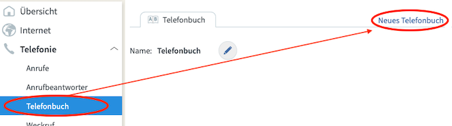

FritzBox-SpamContactList
========================

A spam list as FritzBox address book (contact list).

Introduction
------------

You can block up to 32 numbers in your FRITZ!Box. If you want to block more than 32 phone numbers, you can also create a phone book in which you store all unwanted numbers and have this automatically blocked by the FRITZ!Box.

See at: https://avm.de/ratgeber/nie-wieder-werbeanrufe/

In order to simplify the work, I provide an xml file for the import on the FRITZ!Box.

Installation
------------

Download the [xml-file](./contactlist/FritzBox-Spam-Phonebook.xml) `FritzBox-Spam-Phonebook.xml` in the sub folder `contactlist`.

After that login to your FRITZ!Box select "*Telefonbuch*" (phone book) and create a new one.

Select the the phone book and click "*Wiederherstellen*" (restore).

Select the downloaded file.

